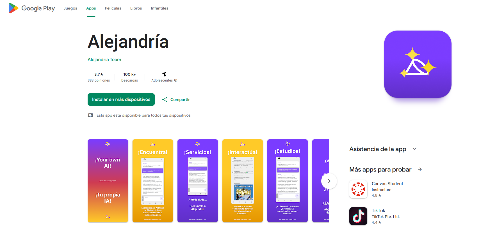

# Alejandría Frontend ✨

## What is Alejandría?

Alejandría is an innovative web platform designed to foster social interaction in a way similar to Twitter, but with an added value: the integration of artificial intelligence (AI). Through this platform, users can share posts, interact with each other, and also leverage the power of language models (LLMs) in the chat to make queries based on the information generated within the platform. This enables searches that are personalized and based on the users’ own data, creating a rich and tailored experience.

In addition to social functionalities, Alejandría features a marketplace section where users can exchange products or services, making it a comprehensive space for both social interaction and digital commerce.

Alejandría was developed from scratch, starting with the architectural design, followed by the MVP (Minimum Viable Product) development, including both frontend and backend, cloud deployment, and integration with an application packager for distribution in the Play Store. In this repository, you will specifically find the code for the frontend of this project.

### 
[▶️ Watch the video of the demo here 🫡](https://www.youtube.com/watch?v=yGEeAZTmpWc)

## Key Features 🔥

- **Authentication and Authorization:** Implementation of JWT (JSON Web Tokens)-based authentication to ensure the security of user accounts.
- **Persistent Sessions:** Keeps user sessions active for 15 days using cookies.
- **User Registration:** Create an account using a username and email address.
- **Email Validation:** Confirm user identity through a verification link sent via email.
- **Profile Editing:** Users can update their personal information, including profile picture, name, and unique username.
- **Logout:** Option to easily log out of the account.

### Social Interaction

- **Post Feed:** View a continuous flow of posts with infinite scrolling.
- **Multimedia Posts:** Ability to share text along with images.
- **Automatic Link and Email Detection:** Links and email addresses in posts are automatically recognized.
- **Social Interaction:** Users can like and comment on posts.
- **Follower System:** Users can follow and be followed by other accounts, fostering an active social network.
- **Profile Search:** Search tool to find other users on the platform.

### Advanced Features

- **AI Chat:** Interaction with an AI-powered chatbot, which uses platform data to respond to queries.
- **Notifications:** Receive real-time notifications about new followers, likes, and comments.
- **Dark Mode:** Option to switch between light and dark themes.

## You can clone this repository and install it locally ✅🫡

To get started, simply clone this repository (`git clone`), install its dependencies (`npm i`) and run the application (`npm start`).
Remember to be in the directory where you want to clone the project. Git must be installed on your computer. 👍🏻
